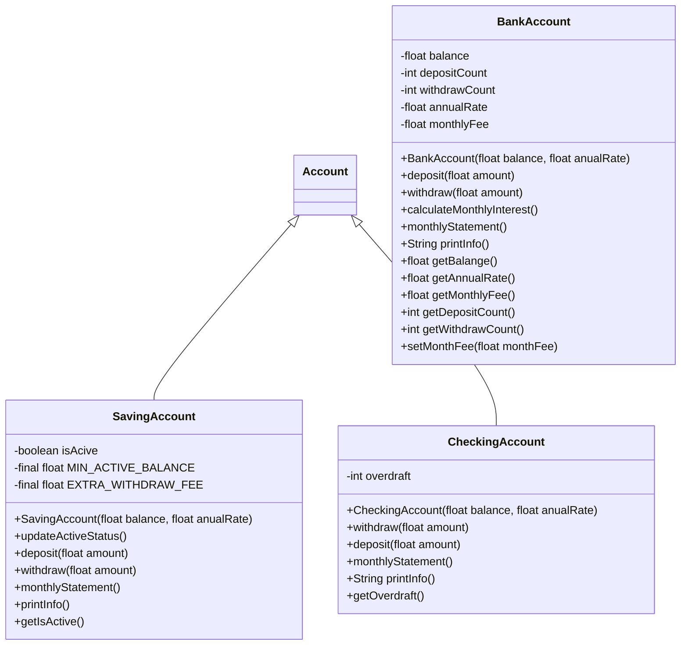
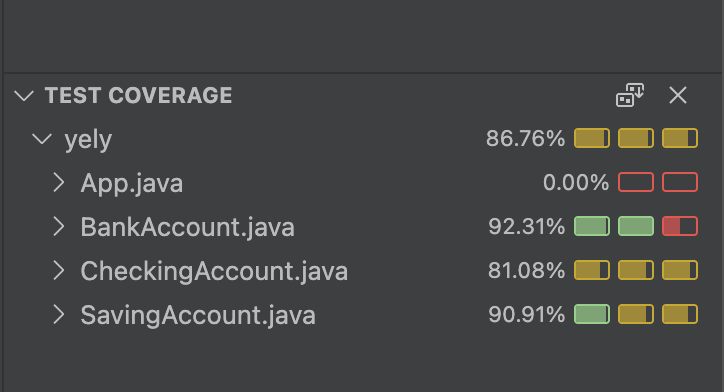

# 🏦 Bank Account

[](https://www.oracle.com/java/)
[](https://junit.org/junit5/)
[](https://maven.apache.org/)
[](#)

## 📌 Description

Java program that models the behavior of a **bank account** with inheritance and polymorphism.  
It includes classes for savings accounts and checking accounts, with balance management, withdrawals, deposits, fees, and overdrafts.

- ✅ Object-oriented design with inheritance
- ✅ UML diagram included
- ✅ Complete unit tests
- ✅ Code coverage ≥ 70%

## 🚀 Getting Started

### Prerequisites

- JDK 21
- Maven 3.9.6+
- Git

### Installation

```bash
git clone https://github.com/yelykrass/bank-account.git
cd exercise-java-bank_account
mvn clean install
```

📝 Implementation Requirements

    Account class with:

        Balance (float)

        Number of deposits (int, initial 0)

        Number of withdrawals (int, initial 0)

        Annual interest rate (float)

        Monthly fee (float, initial 0)

    Methods:

        deposit(float amount)

        withdraw(float amount)

        calculateMonthlyInterest()

        monthlyStatement()

        printAccountDetails()

    Savings Account:

        Active/inactive depending on minimum balance $10,000

        Limit of 4 withdrawals without extra fees

    Checking Account:

        Attribute overdraft

        Allows withdrawals greater than balance

        Deposits reduce overdraft

📊 UML



📸 Test Coverage

## 

(screenshot from VSCode)
